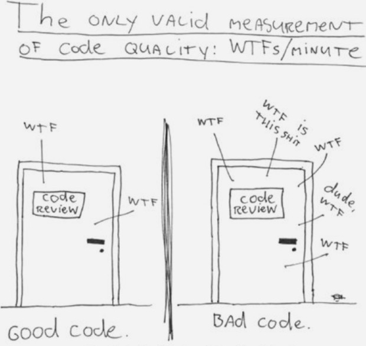
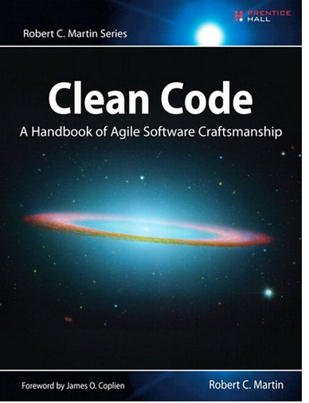

# Best practices
## Olav Vahtras

Leiden 2015-04-14

---

layout: false

## Good practices and clean code

* Good programming practices come from experience
--

* Experience comes from bad programming practices
--

* Being able to recognize clean code does not mean we can write it
--

* Learning to write clean code is hard work!

---

---

## What characterizes clean code?

* Well organized
--

* Code clearly expresses its intention
--

* Code can be read like a newspaper article, well-written prose
--

* Pleasing to read
    - code is read much more than written
--

* No code repetition
    - *Code duplication is the root of all evil*...
--

* Short functions
--

* Functions do one thing and one thing well
--

* Clean code is well tested
--

* Clean code is easy to change
--

* Dependencies between different parts kept to a minimum

---

## What are good habits?

* Forget about the engineering principle "If it ain't broke don't fix is"
--

* The Boy Scout rule: always leave the code in a better shape than you found it.
--

* Variable and function names are well chosen.
    - pronounceable
    - searchable in code (avoid 0, O, l 1)
    - length of a variable name proportional to scope
--

* Frequently reflect and be willing to change
--

* Coding is a two-phase product, extending code and refactoring
--

* Refactor code mercilessly
    - the act of modifying code without changing functionality
    - "clean-up"
--

* Code design is a process not and endpoint
--

* Make the code readable is as important as making it executable

---

## What are signs to look for?

* If you need comments to explain a code you should rewrite the code
--

* Obsolete or bad comments (be better off without)
--

* If you are afraid that changes may break the code you have too few tests.
--

* If your functions are long they probably do too much
--

* Are there variable names with similar spelling?

---

## Testing and version control

* This are not optional!
--

* Change code in small steps
--

* Never commit code that have broken tests

---

##  Functions

* The first rule of functions is that they should be small
--

* The second rule of functions is that *they should be smaller than that.*
   (Robert C Martin)
--

* Functions should hardly ever be 20 lines long.
--

* Indent level should not be greater than two
--

* Do one thing and do it well
    - but it can be difficult know what that "one thing" is
    - try to keep the statements of a function at the same level of abstraction
    -e.g. do something or change something, but not both
--

* Try to make the code read like a top-down narrative
--

* A long descriptive function name is better than a comment
--

* The fewer arguments the better
--

* Avoid side effects

---

### How to write functions like this?

* Even very experienced programmers do not this from scratch
--

* First versions may be long and clumsy
--

* The you need to refactor. (Improve variable named, extract functions, eliminate duplication)
--

* You need unit tests (again!)
--

* Write your programs like a story to be told

---

### Comments
--

* Comments is to compensate for our failure to express ourselves in code
--

* Comments often do not follow changes in code ("lies")
--

* Aim at write code that do not require comments at all
--

* Inaccurate comments are worse than no comments
--

* Commented history in source files is unnecessary - we have version control
--

* Commented code - remove.

---

## On code style

* It is a good idea to follow the Python PEP-8 style  guide
    - https://www.python.org/dev/peps/pep-0008/
--

* You can use the `pylint` program to check Python code against the standard
--

* Examples
    - 4 spaced indentation
    - class name in CamelCase
    - constants in UPPER_CASE with underscores
    - most other variable in lower_case with underscores
    
---

## Literature

To read more, consider e.g.

